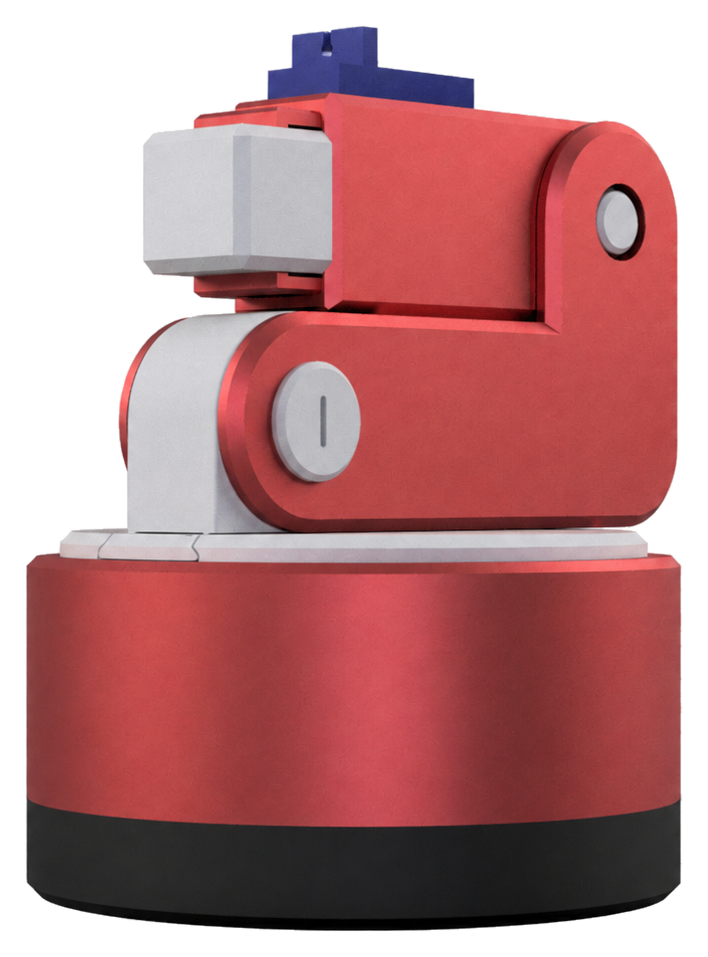
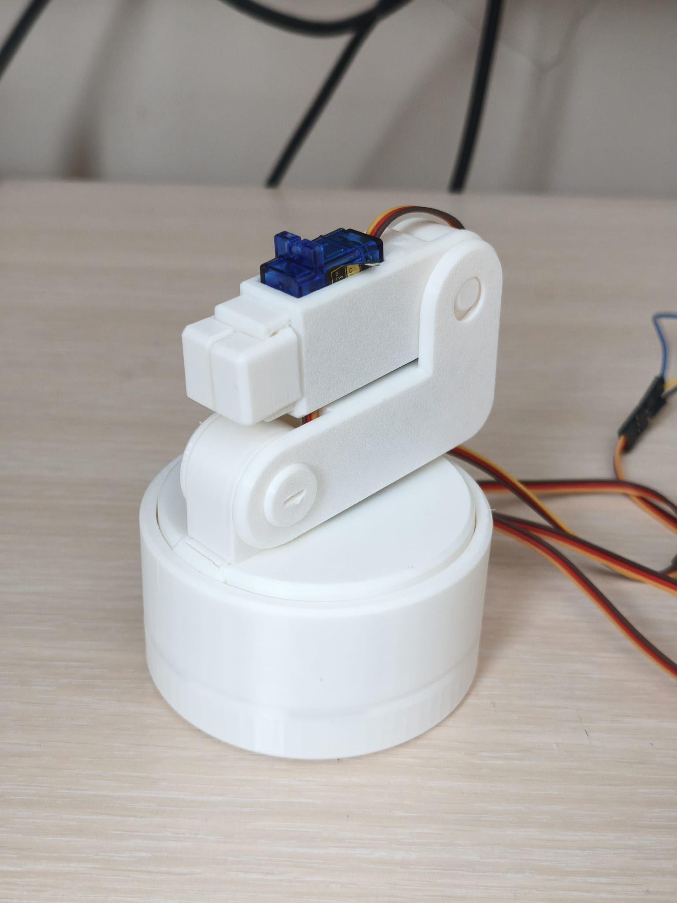
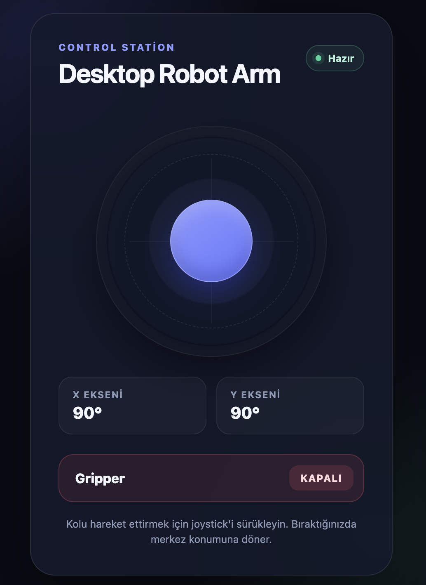
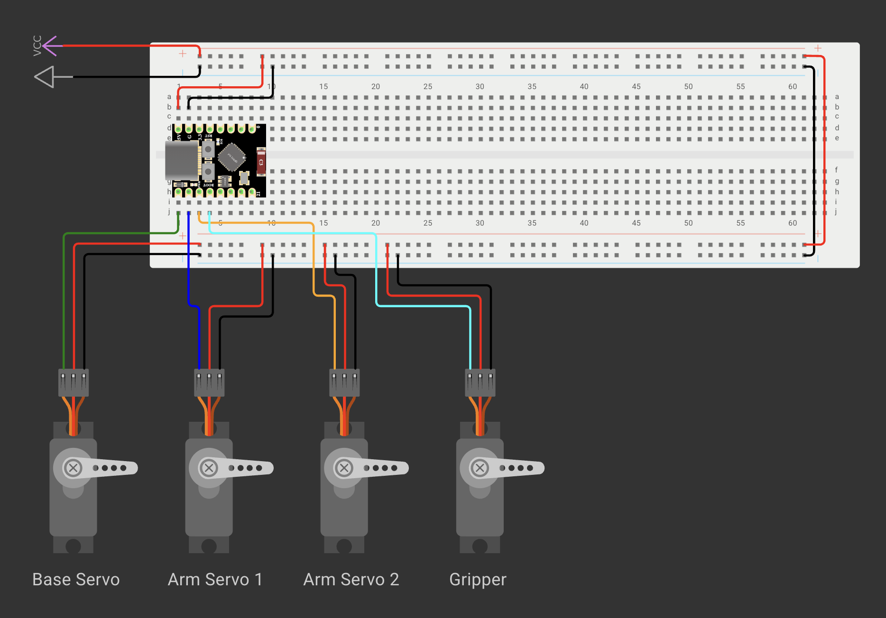

<p align="center">
  
</p>

# Desktop Robot Arm

<p align="center">
  
</p>

A compact, 3D-printed desktop robot arm built around an ESP32-C3 Mini and four SG90 servo motors. The arm creates its own Wi-Fi network and can be controlled from a phone or computer through a browser-based joystick—no separate app or internet connection is required.

This repository contains individual STL files, a ready-to-open 3MF print project, PlatformIO firmware, and reference images for the working prototype.

> [!IMPORTANT]
> This is a prototype rather than a finished consumer product. Keep hands clear of the gears and joints while it is powered, supervise it during use, and disconnect power before making mechanical or electrical changes.

## Features

- Compact, single-level rotating base with an internal ring gear
- 3D-printable body, arm, transmission, and gripper parts
- Three continuous-rotation servos for the base and arm movement
- One 180° servo for opening and closing the gripper
- ESP32-hosted responsive web interface
- Two-axis on-screen joystick with automatic stop on release
- Direct Wi-Fi access-point operation; no router or cloud service required

## How It Works

The ESP32-C3 creates a local Wi-Fi access point and serves the control page stored in the firmware. Joystick commands are sent to the ESP32 over HTTP. The X axis drives the rotating base, the Y axis drives both arm motors, and the **Gripper** button controls the fourth servo.

The mechanical design uses a ring gear in the base and helical gears in the arm to redirect the servos' rotation while keeping the assembly compact.



## Demo

[▶ Watch the Desktop Robot Arm demonstration on YouTube](https://youtube.com/shorts/cK7WrAel_FE?feature=share)

## Repository Contents

```text
.
├── docs/
│   └── assets/
│       ├── assembly/
│       ├── images/
│       ├── desktop-robot-arm-demo.gif
│       ├── final-prototype.jpeg
│       ├── project-render-transparent.png
│       └── wiring-diagram.png
├── firmware/
│   ├── platformio.ini
│   └── src/main.cpp
└── mechanical/
    ├── desktop-robot-arm.3mf
    └── stl-files/
        └── *.stl
```

- `mechanical/desktop-robot-arm.3mf` contains all 17 printable parts arranged on one build plate together with the saved slicer profile.
- The individual STL files in [`mechanical/stl-files/`](mechanical/stl-files/) can be imported separately when a different plate arrangement or slicer is preferred.
- `firmware/` is a PlatformIO project targeting the ESP32-C3 DevKitM-1 environment with the Arduino framework.
- `docs/assets/` contains the documentation images, assembly illustrations, and animation.

## Bill of Materials

### Electronics

- 1 × ESP32-C3 Mini development board
- 3 × continuous-rotation (360°) SG90 servo motors
- 1 × positional (180°) SG90 servo motor
- 1 × regulated 5 V, 3 A power adapter
- 1 × DC barrel-jack screw terminal compatible with the adapter
- 1 × breadboard
- Jumper wires

### Mechanical

- [`desktop-robot-arm.3mf`](mechanical/desktop-robot-arm.3mf), or all individual STL files in [`mechanical/stl-files/`](mechanical/stl-files/)
- Suitable screws and fasteners for the servos
- 3D printer and filament

## Wiring

| Function      | Servo type          | ESP32-C3 signal pin |
| ------------- | ------------------- | ------------------: |
| Base rotation | Continuous rotation |              GPIO 5 |
| Arm servo 1   | Continuous rotation |              GPIO 6 |
| Arm servo 2   | Continuous rotation |              GPIO 7 |
| Gripper       | 180° positional     |              GPIO 8 |



The diagram shows the four servo signal connections and the shared power rails. Connect the external supply to the breadboard VCC and GND rails, power all servos from those rails, and connect the ESP32 ground to the same GND rail to provide a common reference for the PWM signals.

Power the servo motors from the regulated **5 V, 3 A external supply**, not from the ESP32's 3.3 V pin. Connect the servo supply ground and ESP32 ground together so that the PWM signals share a common reference.

> [!CAUTION]
> Check the polarity and rated voltage of every component before applying power.

## Mechanical Assembly

1. Open [`desktop-robot-arm.3mf`](mechanical/desktop-robot-arm.3mf) in Bambu Studio or another compatible slicer. Alternatively, import the individual STL files from [`mechanical/stl-files/`](mechanical/stl-files/).
2. Review the saved printer, filament, support, and plate settings before slicing. The included project was prepared with a Bambu Lab A1 profile, a 0.4 mm nozzle, 0.20 mm layer height, PLA, and supports enabled; adjust these values for your printer and material.
3. Print all parts and remove supports and print residue.
4. Follow the illustrated [`desktop-robot-arm-assembly-guide.md`](desktop-robot-arm-assembly-guide.md).

At a high level, assembly consists of the following stages:

1. Install the arm and gripper servos, then join the geared arm modules.
2. Fit the gear cover and lower arm brace, then secure the joints with the printed fasteners.
3. Attach the arm to the rotating platform and install its retaining clip.
4. Install the base-rotation servo and drive gear, then join the rotating platform to the static ring-gear base.
5. Install the two gripper jaws and their synchronizing gear.
6. Turn every joint by hand and check that the gears move freely before connecting power.

## Firmware Installation

### Requirements

- [Visual Studio Code](https://code.visualstudio.com/) with the [PlatformIO IDE extension](https://platformio.org/install/ide?install=vscode), or PlatformIO Core
- A data-capable USB cable
- An ESP32-C3 Mini compatible with PlatformIO's `esp32-c3-devkitm-1` board definition

The required Arduino Servo library is declared in `firmware/platformio.ini` and will be installed automatically by PlatformIO.

### Upload with PlatformIO IDE

1. Open the [`firmware`](firmware/) folder in Visual Studio Code.
2. Connect the ESP32-C3 Mini over USB.
3. Select the **esp32-c3-devkitm-1** PlatformIO environment.
4. Run **Upload**. PlatformIO should detect the connected serial port automatically.
5. Open the serial monitor at **115200 baud** to see the access-point IP address.

### Upload with PlatformIO Core

From the repository root:

```bash
cd firmware
pio run --target upload
pio device monitor --baud 115200
```

If PlatformIO cannot detect the board automatically, list the available serial ports with `pio device list` and pass the correct port to the upload or monitor command.

## Using the Robot Arm

1. Place the robot on a stable surface and make sure the joints can move safely.
2. Apply power to the servo supply and ESP32.
3. On a phone or computer, connect to the Wi-Fi network:
   - **SSID:** `Desktop-Robot-Arm`
   - **Password:** `123456789`
4. Open the IP address printed in the serial monitor. With the default ESP32 SoftAP configuration this is normally `http://192.168.4.1/`.
5. Drag the joystick to rotate the base and move the arm.
6. Release the joystick to stop the three continuous-rotation servos.
7. Use the **Gripper** button to open or close the gripper.

The Wi-Fi name and password can be changed near the top of [`firmware/src/main.cpp`](firmware/src/main.cpp).

## Calibration and Troubleshooting

### A continuous-rotation servo moves while the joystick is centered

The firmware uses a `1500 µs` pulse as the stop point. Continuous-rotation servo neutral points vary. Adjust the center value in `stopAllServos()` and the pulse range in `handleMotor()` if a servo creeps or moves unevenly.

### The ESP32 resets when the arm moves

- Use a stable 5 V supply capable of at least 3 A.
- Do not power all servos through the ESP32 board.
- Confirm that all grounds are connected together.
- Check for stalled joints, tight gears, or wiring voltage drops.

### The Wi-Fi network does not appear

- Confirm that the firmware uploaded successfully.
- Check the serial monitor at 115200 baud.
- Keep the reduced Wi-Fi transmit-power setting in the firmware; it was required for stable operation on the prototype board.
- Verify the 5 V supply under servo load.

### The arm moves in the wrong direction

Servo orientation can reverse the expected motion. Check the physical installation first; if necessary, reverse the relevant mapping in `handleMotor()`.

## Known Limitations

- The control API is plain HTTP on a local network and has no authentication beyond the Wi-Fi password.
- Servo neutral points and travel values may require calibration for different motors.
- The current web interface assumes one active operator and does not report actual joint position.
- End stops, collision detection, current limiting, and emergency-stop hardware are not implemented.

## License

The original firmware, mechanical design files, documentation, and images created for this project are released under the [MIT License](LICENSE).

The included 3MF file may embed slicer-generated printer profiles, start/end G-code, presets, trademarks, and other metadata supplied by Bambu Lab or other third-party tools. Those embedded third-party materials are not relicensed under MIT and remain subject to the terms and rights of their respective owners. Third-party libraries installed by PlatformIO are likewise governed by their own licenses.
